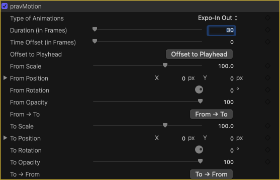

      
  <h1>✨ pravMotion - An Open source animation plugin for Final Cut pro</h1>
  
<b>PravMotion plugin is an open source final cut pro plugin built using apple’s fxplug sdk. Supports final cut pro 11 and 12.</b>

  
  
   
  
  <h2>🚀 Easy Seamless Animation</h2>
  
Create seamless, continuous animations across multiple clips without the keyframe headache.

  

  <h2>🚀 New Feature: Offset Animation to Playhead</h2>
  
Easily align your animation start times directly to the playhead for a more intuitive workflow.

  

  <h2>📈 Professional Easing Options</h2>
  
Choose from <b>more than 20 eases</b>—including <i>Back, Elastic, and Bounce</i>—to make your animations look fluid, attractive, and professional.

  

 

  <h3>👀 See it in action</h3>
  

  <h3>🛠️ Watch the Demo(old version)</h3>
  
  

 

---

## 💻 Requirements
To use or build **pravMotion**, ensure your system meets the following specifications:

| Component | Minimum Requirement |
| :--- | :--- |
| **Xcode** | 16.2 |
| **macOS** | 15.7.3 (Sequoia) |
| **Motion** | 5.9 |
| **Works in** | Final Cut Pro 11 & 12 |
---

## 🔓 Open Source
This project is open source and built using Apple's **FxPlug SDK**. The final cut pro plugin scene seems close knit one with not enough knowldge flowing around except few big shot developers. I hope this project inspire common final cut users/hobbiests/coders to build more plugins.

### 📜 License
pravMotion is released under the **MIT License**. You are free to use, modify, and distribute it in both personal and commercial projects.
 

---
## 📦 Prebuilt Package & Support

The prebuilt app, templates, and manual are available in the **[Releases section](https://github.com/pravbk100/pravMotion/releases)**.

### Support the Project
If you find this tool useful, consider supporting the project through these platforms:

---
### 🤝 Contributing
Contributions are Welcome.
1. **Fork** the Project
2. **Create** your Feature Branch
3. **Commit** your Changes

---

  
Created with ❤️ by <a href="https://github.com/prvbk">Prvbk</a>

