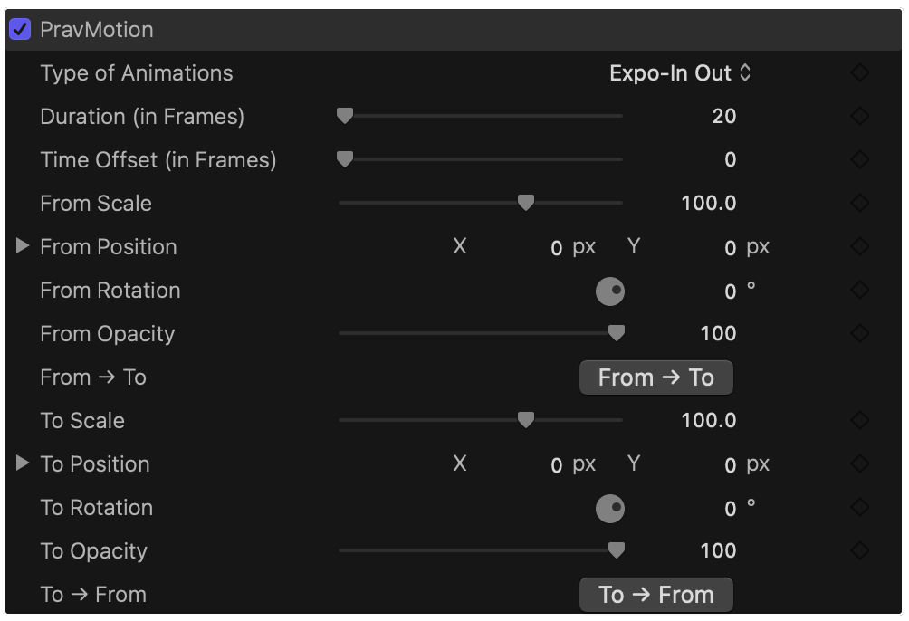
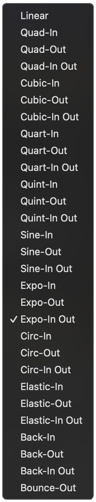

<htediv align="center">
     
  <h1>✨ pravMotion - An animation plugin for Final Cut pro</h1>
  
<b>PravMotion plugin is a final cut pro plugin and effect built using apple’s fxplug sdk and Apple motion. Create motion graphic animations with ease using this plugin. Supports final cut pro 11 and 12.</b>

  

   
  <h1>🚀 Buy Here</h1>
  
Apply "pravBK" coupon for $10 discount on polar

   
  
  
  

 

  
— or —

  
   
  
   
  
<b>Download Free / Lite version</b>

  

  <h3>👀 See it in action</h3>
  

  <h3>🛠️ Installation and Demo</h3>
  

  <h3>📖 Documentation</h3>
  

 

---
### 🎨 Why pravMotion?
You can choose various types of easing types for your animation which final cut pro and motion lacks. And The best of all, there are no keyframes. The plugin handles duration set by you. And Using time offset, you can adjust the time for - where the animation should start from, as you desire.

| Features | Description |
| :--- | :--- |
| **Advanced Easing**   | 
 Includes more than 20 types of easing.    
 |
| **Duration**   | *Set the animation duration as you desire.* |
| **Time Offset**   | *Set time offset to shift the animation on the layer to wherever you want.* |
| **From Values...**   | *Modify these starting values - scale, position, rotation, opacity as you desire.* |
| **To Values...**   | *Modify these animation end values - scale, position, rotation, opacity as you want.* |
| **From → To**   | *This button copies all the "From values" to "To values".* |
| **To → From**   | *This button copies all the "To values" to "From values".* |

---

### 📦 What's Included?
- ✅ **prvMotion App** To install the plugin and use it in final cut pro or motion.
- ✅ **pravMotion effect** The motion effect template.
- ✅ **Manual** Instructions on installation and details about the plugin.

 

---

## 💎 Lite vs. Paid Comparison

| Feature | ⚪ Lite Version | 🔵 Paid Version |
| :--- | :---: | :---: |
| **Ease Types** | ✅ | ✅ |
| **Duration** | 15 frames | unlimited |
| **Time offset** | 10 frames | unlimited |
| **Future Updates** | ✅ | ✅ |
| **Support** | Community | Priority Email |

 

  <h3>Ready to level up your motion game?</h3>
  <a href="https://buy.polar.sh/polar_cl_HwXAVxNxvk6Dz0MCh6MkSsmLekl9xUKjV6iNW3Umj7S">
    <b>Download pravMotion on Polar →</b>
  </a>
   
  <a href="https://pravbk.gumroad.com/l/ibxbg">
  <b>Download pravMotion on Gumroad →</b>
  </a>

---

## 🤝 Support & Community

If you find **pravMotion** helpful, please consider:
* 🌟 **Starring this repository** to show your support!
* 💬 **Reporting bugs** via [GitHub Issues](https://github.com/pravbk100/pravMotion/issues).
* 🎞️ **Tagging #pravMotion** on social media so I can see what you create!

### ☕ Support the Developer
Maintaining a plugin built on the **FxPlug SDK** requires constant updates for new macOS and FCP versions. If this tool helps your workflow, consider supporting my work:

&nbsp;

### 🙏 Credits
Built with ❤️ for the Final Cut Pro community using **Apple’s FxPlug SDK** and **Apple Motion**.

---

  
© 2026 Pravbk All rights reserved.

